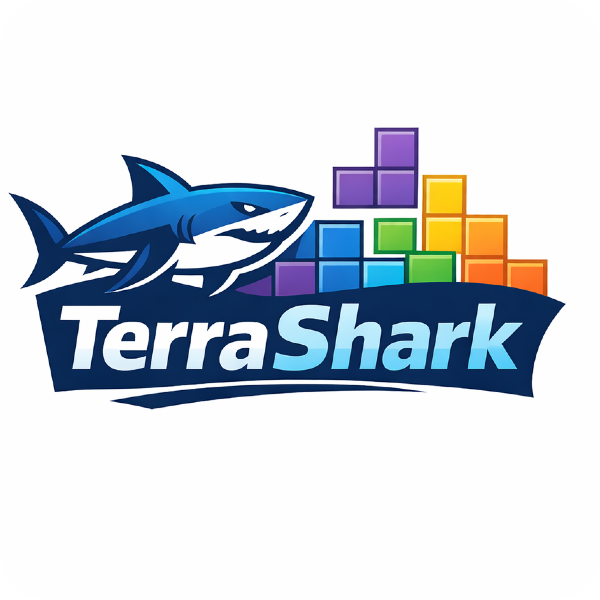

# Terraform Skill for Claude Code and Codex: TerraShark

<div align="center" name="top">
  

<!-- spacer -->
<p></p>

[](https://docs.claude.ai/docs/agent-skills)
[](https://developers.openai.com/codex/skills/)
[](https://opensource.org/licenses/MIT)
[](https://github.com/LukasNiessen/terrashark)

</div>

### Fixes Hallucinations.

LLMs hallucinate a lot when it comes to Terraform. This skill fixes it. It includes best practices for Terraform and OpenTofu - good, bad, and neutral examples so the AI avoids common mistakes. Using TerraShark, the AI keeps proven practices in mind, eliminates hallucinations, and defaults to modular, reusable, security-first design.

### Very Token-Efficient.

Most Terraform skills dump huge text-of-walls onto the agent and burn expensive tokens - with no upside. LLMs don't need the entire Terraform docs again. TerraShark was aggressively de-duplicated and optimized for maximum quality per token.

### Based on HashiCorp's Official Best Practices.

TerraShark is primarily based on [HashiCorp official recommended practices](https://developer.hashicorp.com/terraform/cloud-docs/recommended-practices). When guidance conflicts, it prioritizes HashiCorp's recommendations.

---

[Quick Start](#-quick-start) • [Why TerraShark](#-why-terrashark) • [Token Strategy](#-token-strategy) • [What's Included](#-whats-included) • [How It Works](#-how-it-works) • [Philosophy](PHILOSOPHY.md)

---

## ⚡ 2 min Quickstart

### Option 1: Clone

**macOS / Linux:**

```bash
git clone https://github.com/LukasNiessen/terrashark.git ~/.claude/skills/terrashark
```

**Windows (Powershell):**

```powershell
git clone https://github.com/LukasNiessen/terrashark.git "$env:USERPROFILE\.claude\skills\terrashark"
```

**Windows (Command Prompt):**

```powershell
git clone https://github.com/LukasNiessen/terrashark.git "%USERPROFILE%\.claude\skills\terrashark"
```

That's it. Claude Code auto-discovers skills in `~/.claude/skills/` — no restart needed.

### Option 2: Marketplace

Claude Code has a built-in plugin system with marketplace support. Instead of cloning manually, you can add TerraShark's marketplace and install directly from the CLI:

```
/plugin marketplace add LukasNiessen/terrashark
/plugin install terrashark
```

Or use the interactive plugin manager — run `/plugin`, switch to the **Discover** tab, and install from there. The marketplace reads the `.claude-plugin/marketplace.json` in this repo to register TerraShark as an installable plugin.

### Option 3: Codex

Codex has no global skill system — setup is per-project. Clone TerraShark into your repo and reference it from your `AGENTS.md`:

```bash
# Clone into your project root
git clone https://github.com/LukasNiessen/terrashark.git .terrashark
```

Then add to your `AGENTS.md` (or create one in the repo root):

```markdown
## Terraform

When working with Terraform or OpenTofu, follow the workflow in `.terrashark/SKILL.md`.
Load references from `.terrashark/references/` as needed.
```

### That's it!

Done. Now ask Claude Code / Codex any Terraform question. TerraShark responses follow the 7-step failure-mode workflow and include an output contract with assumptions, tradeoffs, and rollback notes.

**Invoke explicitly:**

```bash
/terrashark Create a multi-region S3 module with replication
```

```bash
/terrashark Refactor our EKS stack into separate state files per environment, add moved blocks to avoid recreation, set up a GitHub Actions pipeline with plan on PR and gated apply on merge, and wire in Checkov for compliance scanning
```

**Or just ask naturally** — TerraShark activates automatically for any Terraform/OpenTofu task:

```
Review my main.tf for security issues
```

```
Migrate this module from count to for_each
```

## 🎬 Demo

https://github.com/user-attachments/assets/2bc4c9ff-9f54-4a49-8bf0-5cfc0f26dec6

## 🏁 Why TerraShark

### Overview

| Dimension                        | **TerraShark**                                        | **terraform-skill**                             | **No Skill** |
| -------------------------------- | ----------------------------------------------------- | ----------------------------------------------- | ------------ |
| **SKILL.md activation cost**     | ~600 tokens                                           | ~4,400 tokens                                   | 0            |
| **Reference granularity**        | 18 focused files                                      | 6 large files                                   | —            |
| **Token burn per query**         | Low (load 1-2 small refs)                             | High (large refs, e.g. 1,126 lines for modules) | 0            |
| **Architecture**                 | Failure-mode workflow                                 | Static reference manual                         | —            |
| **Diagnoses before generating**  | Yes (Step 2)                                          | No                                              | No           |
| **Output contract**              | Yes — assumptions, tradeoffs, rollback                | No                                              | No           |
| **Migration playbooks**          | Yes (5 playbooks)                                     | Partial (inline snippets)                       | No           |
| **Good/bad/neutral examples**    | Yes (3 dedicated files)                               | Inline only                                     | No           |
| **Do/Don't checklist**           | Yes (dedicated file)                                  | Inline only                                     | No           |
| **Compliance framework mapping** | Yes (ISO 27001, SOC 2, FedRAMP, GDPR, PCI DSS, HIPAA) | Partial (SOC 2, HIPAA, PCI-DSS)                 | No           |
| **MCP integration guidance**     | Yes                                                   | No                                              | No           |
| **Hallucination prevention**     | Core design goal                                      | Not addressed                                   | No           |
| **Security-first defaults**      | Built-in                                              | Checklist-style                                 | No           |
| **CI/CD templates**              | GitHub Actions, GitLab CI, Atlantis, Infracost        | GitHub Actions, GitLab CI, Atlantis             | No           |
| **License**                      | MIT                                                   | Apache 2.0                                      | —            |

### TerraShark vs terraform-skill

The key difference is architectural. **terraform-skill** is a static reference manual: it dumps ~4,400 tokens into context on every activation, then loads additional reference files that can be over 1,000 lines each. It gives Claude information but never tells it _how to think_ about a problem. There's no diagnosis step, no risk assessment, and no structured output — Claude reads the reference and generates whatever it thinks fits.

**TerraShark** takes the opposite approach. The core SKILL.md is a 79-line operational workflow that costs ~600 tokens on activation — **over 7x leaner**. Instead of front-loading a wall of text, it forces Claude through a diagnostic sequence: capture context → identify failure modes → load _only_ the relevant references → propose fixes with explicit risk controls → validate → deliver a structured output contract.

This matters for three reasons:

1. **Token efficiency.** terraform-skill burns ~4,400 tokens just to activate, before any reference files. A single reference file like `module-patterns.md` (1,126 lines, ~7,000 tokens) can double the cost again. TerraShark's activation is ~600 tokens, and its 18 granular reference files mean Claude loads only what's needed — typically one or two small, focused docs instead of one massive dump.

2. **Hallucination prevention.** terraform-skill provides good patterns but never asks Claude to _diagnose what could go wrong_. TerraShark's Step 2 forces failure-mode identification before any code is generated. Step 4 requires explicit risk controls for every fix. Step 7 enforces an output contract with assumptions, tradeoffs, and rollback notes. This is the difference between giving someone a cookbook and giving them a diagnostic checklist.

3. **Reference coverage.** TerraShark ships 18 focused reference files covering failure modes, migration playbooks, good/bad/neutral examples, do/don't checklists, compliance framework mappings, and MCP integration. terraform-skill has 6 larger files that go deep on testing and module patterns but lack migration playbooks, explicit anti-pattern banks, compliance mappings beyond a few frameworks, and MCP guidance.

**In short:** TerraShark is the better skill due to 7x leaner activation, failure-mode-first diagnostic workflow, output contracts, granular references, and LLM-specific hallucination prevention. terraform-skill wins on HCL example depth and testing docs, but TerraShark's architecture is fundamentally better designed for the core use case of LLM-assisted IaC generation.

---

## 🕵️ Token Strategy

- Keep `SKILL.md` procedural and compact
- Keep references focused on failure-prone decisions
- Exclude broad tutorial material with low safety impact
- Add depth only when measured quality would otherwise drop

See `references/token-balance-rationale.md` for the full decision and tradeoffs.

## 🐣 What's Included

- A focused `SKILL.md` execution flow
- Failure-mode-first guidance to prevent common IaC hallucinations
- Core failure-mode references: identity churn, secret exposure, blast radius, CI drift, compliance gates
- Expanded architecture guidance (state, boundaries, module roles)
- Refactor/migration playbooks for safe evolution
- Stronger CI/CD and governance patterns (including Atlantis + Infracost)
- Risk-based test depth guidance with native test caveats and Terratest coverage
- Rewritten good/bad/neutral example bank
- Do/Don't pattern bank and MCP integration guidance

## 🔲 Repository Layout

Here an overview of the repository layout.

| File                                    | Description                                                   |
| --------------------------------------- | ------------------------------------------------------------- |
| `SKILL.md`                              | Operational workflow for TerraShark                           |
| `PHILOSOPHY.md`                         | Design strategy, architecture decisions, token experiment     |
| `references/identity-churn.md`          | Address stability, `count`/`for_each`, `moved` safety         |
| `references/secret-exposure.md`         | Preventing secret leakage through state/logs/artifacts        |
| `references/blast-radius.md`            | State boundaries, environment isolation, apply impact control |
| `references/ci-drift.md`                | Production CI drift prevention and plan/apply integrity       |
| `references/compliance-gates.md`        | Policy gates, approvals, evidence, framework mappings         |
| `references/structure-and-state.md`     | State, boundaries, and apply safety                           |
| `references/module-architecture.md`     | Module role model and composition rules                       |
| `references/coding-standards.md`        | Naming, typing, iteration, versioning                         |
| `references/migration-playbooks.md`     | moved/import/refactor/upgrade playbooks                       |
| `references/testing-matrix.md`          | Test tiering, native test caveats, Terratest guidance         |
| `references/ci-delivery-patterns.md`    | CI stages and production-oriented pipeline templates          |
| `references/security-and-governance.md` | Security controls and operational governance                  |
| `references/quick-ops.md`               | Command sequence and troubleshooting shortcuts                |
| `references/examples-good.md`           | Strong implementation examples                                |
| `references/examples-bad.md`            | Anti-pattern examples                                         |
| `references/examples-neutral.md`        | Context-based tradeoff examples                               |
| `references/do-dont-patterns.md`        | Do/Don't pattern checklist                                    |
| `references/mcp-integration.md`         | MCP integration guidance                                      |
| `references/token-balance-rationale.md` | Why the skill stays lean and where depth is kept              |
| `.github/workflows/validate.yml`        | CI validation for skill structure and links                   |
| `.github/PULL_REQUEST_TEMPLATE.md`      | PR quality and failure-mode checklist                         |
| `.claude-plugin/marketplace.json`       | Plugin metadata                                               |

## 🔎 How It Works

The skill runs as a failure-mode workflow whenever Claude Code handles Terraform or OpenTofu tasks:

1. **Capture execution context** - Runtime/version, providers, backend, execution path, risk level
2. **Diagnose likely failure mode(s)** - Identity churn, secret exposure, blast radius, CI drift, compliance gate gaps
3. **Load only relevant references** - Pull targeted guidance for the failure mode(s) in scope
4. **Propose fix path with controls** - Include risk notes, approvals, tests, and rollback expectations
5. **Generate implementation artifacts** - HCL changes, migration blocks, CI/policy updates
6. **Validate before finalize** - Runtime-appropriate command sequence and risk-tier checks
7. **Deliver complete output** - Assumptions, remediation choices, tradeoffs, validation plan, recovery notes

## 🐲 Scope

- Terraform and OpenTofu module design/review/refactoring
- Safe migration workflows for existing stacks
- CI/CD and policy integration for infrastructure delivery
- Blast-radius reduction and operational safety

## ℹ️ FAQ

**Q: Does this work with OpenTofu?**

Yes. TerraShark supports both Terraform and OpenTofu. The workflow captures runtime/version first and adapts guidance accordingly.

**Q: Will this slow down my AI interactions?**

No. The skill is designed for low token overhead. Only relevant references should be loaded for a given failure mode.

**Q: Can I use this outside Claude Code?**

Yes. The references are plain Markdown and can be used from any workflow or AI assistant, **including Codex**. The trigger behavior in `SKILL.md` is optimized for skill-enabled environments.

**Q: How was the content validated?**

We started with much larger references and a large automated test suite, then repeatedly removed sections and re-tested. If quality dropped, content was restored. If quality stayed stable, content remained out.

## 🦊 Contributing

We highly appreciate contributions. See [CONTRIBUTING.md](CONTRIBUTING.md) and use the PR template for failure-mode and validation details.

## 💟 Community

### Maintainers

• **[LukasNiessen](https://github.com/LukasNiessen)** - Creator and main maintainer

• **[janMagnusHeimann](https://github.com/janMagnusHeimann)** - Main maintainer

• **[TristanKruse](https://github.com/TristanKruse)** - Main maintainer

### Contributors

<a href="https://github.com/LukasNiessen/terrashark/graphs/contributors">
  
</a>

### Questions

Found a bug? Want to discuss features?

- Submit an [issue on GitHub](https://github.com/LukasNiessen/terrashark/issues/new/choose)
- Join [GitHub Discussions](https://github.com/LukasNiessen/terrashark/discussions)

If TerraShark helps your project, please consider:

- Starring the repository
- Suggesting new features
- Contributing code or documentation

### Star History

[](https://www.star-history.com/#LukasNiessen/terrashark&Date)

## 📄 License

This project is under the **MIT** license.

---

<p align="center">
  <a href="#top"><strong>Go Back to Top</strong></a>
</p>

---

## Other

**Version:** v2.3.0

**GitHub Pages:** [https://lukasniessen.github.io/terrashark/](https://lukasniessen.github.io/terrashark/)
