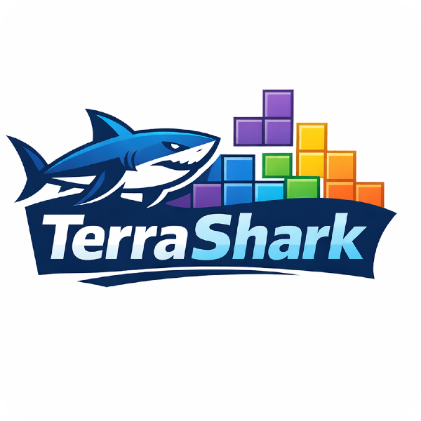

# Terraform Skill for Claude Code, Codex, Antigravity, and Gemini CLI: TerraShark

<div align="center" name="top">
  

<!-- spacer -->
<p></p>

[](https://docs.claude.ai/docs/agent-skills)
[](https://developers.openai.com/codex/skills/)
[](https://geminicli.com/docs/cli/skills)
[](https://antigravity.google/docs/skills)
[](https://opensource.org/licenses/MIT)
[](https://github.com/LukasNiessen/terrashark)

</div>

The #1 Terraform skill for Claude Code and Codex, measured by GitHub stars.

### Fixes Hallucinations.

LLMs hallucinate a lot when it comes to Terraform. This skill fixes it. It includes best practices for Terraform and OpenTofu - good, bad, and neutral examples so the AI avoids common mistakes. Using TerraShark, the AI keeps proven practices in mind, eliminates hallucinations, and defaults to modular, reusable, security-first design.

### Very Token-Efficient.

Most Terraform skills dump huge text-of-walls onto the agent and burn expensive tokens - with no upside. LLMs don't need the entire Terraform docs again. TerraShark was aggressively de-duplicated and optimized for maximum quality per token.

### Based on HashiCorp's Official Best Practices.

TerraShark is primarily based on [HashiCorp official recommended practices](https://developer.hashicorp.com/terraform/cloud-docs/recommended-practices). When guidance conflicts, it prioritizes HashiCorp's recommendations.

---

[Quick Start](#-quick-start) • [Why TerraShark?](#-library-comparison) • [Token Strategy](#-token-strategy) • [What's Included](#-whats-included) • [How It Works](#-how-it-works) • [Sponsor](https://github.com/sponsors/LukasNiessen) • [Philosophy](PHILOSOPHY.md)

---

## ⚡ 2 min Quickstart

### Option 1: Skills CLI

If you manage skills with the `skills` CLI, install TerraShark directly from GitHub:

```bash
npx skills add https://github.com/lukasniessen/terrashark --skill terrashark
```

### Option 2: Marketplace

Claude Code has a built-in plugin system with marketplace support. Instead of cloning manually, you can add TerraShark's marketplace and install directly from the CLI:

```text
/plugin marketplace add LukasNiessen/terrashark
/plugin install terrashark
```

Or use the interactive plugin manager - run `/plugin`, switch to the **Discover** tab, and install from there. The marketplace reads the `.claude-plugin/marketplace.json` in this repo to register TerraShark as an installable plugin.

### Option 3: Manual Claude Code Skill

If you cannot use the marketplace, clone the repo and copy the packaged skill directory into Claude Code's skills directory.

**macOS / Linux:**

```bash
git clone https://github.com/LukasNiessen/terrashark.git /tmp/terrashark
mkdir -p ~/.claude/skills/terrashark
cp -R /tmp/terrashark/skills/terrashark/. ~/.claude/skills/terrashark/
```

**Windows (PowerShell):**

```powershell
git clone https://github.com/LukasNiessen/terrashark.git "$env:TEMP\terrashark"
New-Item -ItemType Directory -Force "$env:USERPROFILE\.claude\skills\terrashark"
Copy-Item -Recurse -Force "$env:TEMP\terrashark\skills\terrashark\*" "$env:USERPROFILE\.claude\skills\terrashark\"
```

Claude Code auto-discovers skills in `~/.claude/skills/` - no restart needed.

### Option 4: Codex

Codex has no global skill system - setup is per-project. Clone TerraShark into your repo and reference it from your `AGENTS.md`:

```bash
# Clone into your project root
git clone https://github.com/LukasNiessen/terrashark.git .terrashark
```

Then add to your `AGENTS.md` (or create one in the repo root):

```markdown
## Terraform

When working with Terraform or OpenTofu, follow the workflow in `.terrashark/skills/terrashark/SKILL.md`.
Load references from `.terrashark/skills/terrashark/references/` as needed.
```

### Option 5: Antigravity

**macOS / Linux:**

```bash
git clone https://github.com/LukasNiessen/terrashark.git /tmp/terrashark
mkdir -p ~/.gemini/antigravity/skills/terrashark
cp -R /tmp/terrashark/skills/terrashark/. ~/.gemini/antigravity/skills/terrashark/
```

**Windows (PowerShell):**

```powershell
git clone https://github.com/LukasNiessen/terrashark.git "$env:TEMP\terrashark"
New-Item -ItemType Directory -Force "$env:USERPROFILE\.gemini\antigravity\skills\terrashark"
Copy-Item -Recurse -Force "$env:TEMP\terrashark\skills\terrashark\*" "$env:USERPROFILE\.gemini\antigravity\skills\terrashark\"
```

Antigravity auto-discovers skills in the skills directory — no restart needed.

### Option 6: Gemini CLI

Gemini CLI discovers skills in several standard locations.

**Global Installation (All Workspaces):**

```bash
git clone https://github.com/LukasNiessen/terrashark.git /tmp/terrashark
mkdir -p ~/.gemini/skills/terrashark
cp -R /tmp/terrashark/skills/terrashark/. ~/.gemini/skills/terrashark/
```

**Local Installation (Current Workspace):**

```bash
git clone https://github.com/LukasNiessen/terrashark.git .terrashark
mkdir -p .gemini/skills/terrashark
cp -R .terrashark/skills/terrashark/. .gemini/skills/terrashark/
```

Gemini CLI auto-discovers skills in these directories. Run `/skills list` in the CLI to verify.

### That's it!

Done. Now ask Claude Code / Codex / Antigravity / Gemini CLI any Terraform question. TerraShark responses follow the 7-step failure-mode workflow and include an output contract with assumptions, tradeoffs, and rollback notes.

**Invoke explicitly:**

```text
/terrashark:terrashark Create a multi-region S3 module with replication
```

```text
/terrashark:terrashark Refactor our EKS stack into separate state files per environment, add moved blocks to avoid recreation, set up a GitHub Actions pipeline with plan on PR and gated apply on merge, and wire in Checkov for compliance scanning
```

**Or just ask naturally** - TerraShark activates automatically for any Terraform/OpenTofu task:

```
Review my main.tf for security issues
```

```
Migrate this module from count to for_each
```

## 🎬 Demo

https://github.com/user-attachments/assets/2bc4c9ff-9f54-4a49-8bf0-5cfc0f26dec6

## 📊 Library Comparison

Here's how TerraShark compares to other Terraform and OpenTofu agent skills:

| Feature                          | **TerraShark**                                        | **Anton Babenko terraform-skill** | **terraform-patterns**               |
| -------------------------------- | ----------------------------------------------------- | --------------------------------- | ------------------------------------ |
| **Core Architecture**            | ✅ Failure-mode workflow                              | ⚠️ Static reference manual        | ⚠️ Pattern checklist                 |
| **SKILL.md Activation Cost**     | ✅ ~600 tokens                                        | ⚠️ ~4,400 tokens                  | ⚠️ Single broad reference            |
| **Reference Granularity**        | ✅ 19 focused files                                   | ⚠️ 6 large files                  | ❌ No focused reference library      |
| **Token Burn Per Query**         | ✅ Low (load 1-2 small refs)                          | ⚠️ High for deep references       | ⚠️ Loads broad guidance              |
| **Diagnoses Before Generating**  | ✅ Step 2 requires diagnosis                          | ❌ No                             | ❌ No                                |
| **Hallucination Prevention**     | ✅ Core design goal                                   | ⚠️ Indirect via best practices    | ⚠️ Indirect via patterns             |
| **Output Contract**              | ✅ Assumptions, tradeoffs, rollback                   | ❌ No                             | ❌ No                                |
| **Failure-Mode Coverage**        | ✅ Identity, secrets, blast radius, CI, compliance    | ⚠️ General state/security advice  | ⚠️ General anti-pattern summary      |
| **Migration Playbooks**          | ✅ 5 dedicated playbooks                              | ⚠️ Partial inline snippets        | ⚠️ Import and moved-block notes      |
| **Good/Bad/Neutral Examples**    | ✅ 3 dedicated files                                  | ⚠️ Inline DO/DON'T examples       | ⚠️ Inline BAD/GOOD snippets          |
| **Do/Don't Checklist**           | ✅ Dedicated file                                     | ⚠️ Inline only                    | ⚠️ Inline only                       |
| **Compliance Framework Mapping** | ✅ ISO 27001, SOC 2, FedRAMP, GDPR, PCI DSS, HIPAA    | ⚠️ Scanner-oriented guidance      | ❌ No                                |
| **Trusted Module Awareness**     | ✅ AWS, Azure, GCP, OCI, IBM loaded conditionally     | ⚠️ AWS module context             | ❌ No                                |
| **MCP Integration Guidance**     | ✅ Dedicated reference                                | ⚠️ Optional Terraform MCP mention | ❌ No                                |
| **Claude + Codex Support**       | ✅ First-class Claude Code and Codex setup            | ⚠️ Broad multi-agent setup        | ⚠️ Claude plugin oriented            |
| **Security-First Defaults**      | ✅ Built into the workflow                            | ⚠️ Checklist-style                | ⚠️ Style-guide based                 |
| **CI/CD Templates**              | ✅ GitHub Actions, GitLab CI, Atlantis, Infracost     | ✅ GitHub Actions, GitLab CI      | ⚠️ Pipeline rules only               |
| **License**                      | ✅ MIT                                                | ⚠️ Apache 2.0                     | ❌ Not highlighted in skill listing  |

As you see in the table, there are some features that are only supported by us. Here is a brief highlight of those that we believe are the most critical of them:

- **Failure-mode workflow**: TerraShark does not just give the agent Terraform facts. It forces the agent to identify the likely failure mode first, then load the exact reference material needed for that risk.

- **Output contract**: TerraShark responses include assumptions, remediation choices, tradeoffs, validation steps, and rollback notes. Other skills leave that structure to the model.

- **Token efficiency**: TerraShark keeps the activation path tiny and moves depth into focused references. This gives the agent the right Terraform context without turning every request into a large reference dump.

- **Compliance mapping**: TerraShark includes explicit mappings for ISO 27001, SOC 2, FedRAMP, GDPR, PCI DSS, and HIPAA. Other skills focus more on scanners than audit-ready control mapping.

- **Trusted module awareness**: TerraShark knows when to prefer mature vendor and community modules for AWS, Azure, GCP, Oracle Cloud, and IBM Cloud, reducing the surface area for hallucinated raw resources.

- **LLM-specific hallucination prevention**: TerraShark is designed around the ways AI agents fail at infrastructure code: unstable identity, leaked secrets, wide blast radius, CI drift, and weak compliance gates.

### TerraShark vs terraform-skill

The key difference is architectural. **terraform-skill** is a static reference manual: it dumps ~4,400 tokens into context on every activation, then loads additional reference files that can be over 1,000 lines each. It gives Claude information but never tells it _how to think_ about a problem. There's no diagnosis step, no risk assessment, and no structured output - Claude reads the reference and generates whatever it thinks fits.

**TerraShark** takes the opposite approach. The core SKILL.md is an 86-line operational workflow that costs ~600 tokens on activation - **over 7x leaner**. Instead of front-loading a wall of text, it forces Claude through a diagnostic sequence: capture context → identify failure modes → load _only_ the relevant references → propose fixes with explicit risk controls → validate → deliver a structured output contract.

This matters for three reasons:

1. **Token efficiency.** terraform-skill burns ~4,400 tokens just to activate, before any reference files. A single reference file like `module-patterns.md` (1,126 lines, ~7,000 tokens) can double the cost again. TerraShark's activation is ~600 tokens, and its 19 granular reference files mean Claude loads only what's needed - typically one or two small, focused docs instead of one massive dump.

2. **Hallucination prevention.** terraform-skill provides good patterns but never asks Claude to _diagnose what could go wrong_. TerraShark's Step 2 forces failure-mode identification before any code is generated. Step 4 requires explicit risk controls for every fix. Step 7 enforces an output contract with assumptions, tradeoffs, and rollback notes. This is the difference between giving someone a cookbook and giving them a diagnostic checklist.

3. **Reference coverage.** TerraShark ships 19 focused reference files covering failure modes, backend-specific state safety, migration playbooks, good/bad/neutral examples, do/don't checklists, compliance framework mappings, and MCP integration. terraform-skill has 6 larger files that go deep on testing and module patterns but lack migration playbooks, explicit anti-pattern banks, compliance mappings beyond a few frameworks, and MCP guidance.

**In short:** TerraShark is the better skill due to 7x leaner activation, failure-mode-first diagnostic workflow, output contracts, granular references, and LLM-specific hallucination prevention. terraform-skill wins on HCL example depth and testing docs, but TerraShark's architecture is fundamentally better designed for the core use case of LLM-assisted IaC generation.

---

## 🕵️ Token Strategy

- Keep `SKILL.md` procedural and compact
- Keep references focused on failure-prone decisions
- Exclude broad tutorial material with low safety impact
- Add depth only when measured quality would otherwise drop

See `skills/terrashark/references/token-balance-rationale.md` for the full decision and tradeoffs.

## 🧱 Trusted Module Awareness

Hand-rolled `resource` blocks are one of the largest hallucination surfaces for LLMs; attribute names, defaults, and iteration shapes are where models drift. TerraShark recognizes the major vendor-maintained and community module registries and defaults to using them instead of generating raw resources, whenever a mature module covers the requested service.

### How it helps

- A pinned registry module replaces hundreds of lines of hand-rolled HCL with a version-locked interface already tested across many production stacks
- Removes attribute-name, default-value, and `for_each` drift; the exact spots where LLMs slip
- Enforces **exact** version pinning for production, so module upgrades don't silently change generated resource addresses

### When it loads (lean-token approach)

`skills/terrashark/references/conditional/trusted-modules.md` is pulled into context **only when the detected provider is one of the supported clouds**. AWS-only projects never pay the token cost for Azure or GCP guidance, and vice versa, matching TerraShark's core token-efficiency design.

### Supported providers

| Cloud        | Registry namespace         | Program                            |
| ------------ | -------------------------- | ---------------------------------- |
| AWS          | `terraform-aws-modules`    | Community standard                 |
| Azure        | `Azure`                    | Azure Verified Modules (AVM)       |
| GCP          | `terraform-google-modules` | Cloud Foundation Toolkit           |
| Oracle Cloud | `oracle-terraform-modules` | Vendor-maintained                  |
| IBM Cloud    | `terraform-ibm-modules`    | IBM Deployable Architectures       |

Other ecosystems (Alibaba Cloud, DigitalOcean, Hetzner, etc.) are intentionally not included yet, their module programs are still small or early-stage, so recommending them as defaults would trade one failure mode (hallucinated attributes) for another (unmaintained wrappers). If a provider's ecosystem matures, it can be added later.

## 🐣 What's Included

- A focused `SKILL.md` execution flow
- Failure-mode-first guidance to prevent common IaC hallucinations
- Core failure-mode references: identity churn, secret exposure, blast radius, CI drift, compliance gates
- Backend-specific state safety loaded conditionally for state storage, locking, migration, and restore work
- Expanded architecture guidance (state, boundaries, module roles)
- Refactor/migration playbooks for safe evolution
- Stronger CI/CD and governance patterns (including Atlantis + Infracost)
- Risk-based test depth guidance with native test caveats and Terratest coverage
- Rewritten good/bad/neutral example bank
- Do/Don't pattern bank and MCP integration guidance
- Trusted community/vendor module awareness (AWS, Azure, GCP, OCI, IBM) loaded conditionally

## 🔲 Repository Layout

Here an overview of the repository layout.

| File                                                       | Description                                                   |
| ---------------------------------------------------------- | ------------------------------------------------------------- |
| `skills/terrashark/SKILL.md`                               | Operational workflow for TerraShark                           |
| `PHILOSOPHY.md`                                            | Design strategy, architecture decisions, token experiment     |
| `skills/terrashark/references/identity-churn.md`           | Address stability, `count`/`for_each`, `moved` safety         |
| `skills/terrashark/references/secret-exposure.md`          | Preventing secret leakage through state/logs/artifacts        |
| `skills/terrashark/references/blast-radius.md`             | State boundaries, environment isolation, apply impact control |
| `skills/terrashark/references/ci-drift.md`                 | Production CI drift prevention and plan/apply integrity       |
| `skills/terrashark/references/compliance-gates.md`         | Policy gates, approvals, evidence, framework mappings         |
| `skills/terrashark/references/structure-and-state.md`      | State, boundaries, and apply safety                           |
| `skills/terrashark/references/conditional/backend-state-safety.md` | Backend-specific state safety and migration guardrails |
| `skills/terrashark/references/module-architecture.md`      | Module role model and composition rules                       |
| `skills/terrashark/references/coding-standards.md`         | Naming, typing, iteration, versioning                         |
| `skills/terrashark/references/migration-playbooks.md`      | moved/import/refactor/upgrade playbooks                       |
| `skills/terrashark/references/testing-matrix.md`           | Test tiering, native test caveats, Terratest guidance         |
| `skills/terrashark/references/ci-delivery-patterns.md`     | CI stages and production-oriented pipeline templates          |
| `skills/terrashark/references/security-and-governance.md`  | Security controls and operational governance                  |
| `skills/terrashark/references/quick-ops.md`                | Command sequence and troubleshooting shortcuts                |
| `skills/terrashark/references/examples-good.md`            | Strong implementation examples                                |
| `skills/terrashark/references/examples-bad.md`             | Anti-pattern examples                                         |
| `skills/terrashark/references/examples-neutral.md`         | Context-based tradeoff examples                               |
| `skills/terrashark/references/do-dont-patterns.md`         | Do/Don't pattern checklist                                    |
| `skills/terrashark/references/mcp-integration.md`          | MCP integration guidance                                      |
| `skills/terrashark/references/conditional/trusted-modules.md` | Canonical community/vendor modules per cloud (conditional) |
| `skills/terrashark/references/token-balance-rationale.md`  | Why the skill stays lean and where depth is kept              |
| `.github/workflows/validate.yml`                           | CI validation for skill structure and links                   |
| `.github/PULL_REQUEST_TEMPLATE.md`                         | PR quality and failure-mode checklist                         |
| `.claude-plugin/marketplace.json`                          | Marketplace metadata                                          |
| `.claude-plugin/plugin.json`                               | Claude Code plugin manifest                                   |

## 🔎 How It Works

The skill runs as a failure-mode workflow whenever Claude Code, Codex, Antigravity, or Gemini CLI handles Terraform or OpenTofu tasks:

1. **Capture execution context** - Runtime/version, providers, backend, execution path, risk level
2. **Diagnose likely failure mode(s)** - Identity churn, secret exposure, blast radius, CI drift, compliance gate gaps
3. **Load only relevant references** - Pull targeted guidance for the failure mode(s) in scope
4. **Propose fix path with controls** - Include risk notes, approvals, tests, and rollback expectations
5. **Generate implementation artifacts** - HCL changes, migration blocks, CI/policy updates
6. **Validate before finalize** - Runtime-appropriate command sequence and risk-tier checks
7. **Deliver complete output** - Assumptions, remediation choices, tradeoffs, validation plan, recovery notes

## 🐲 Scope

- Terraform and OpenTofu module design/review/refactoring
- Safe migration workflows for existing stacks
- CI/CD and policy integration for infrastructure delivery
- Blast-radius reduction and operational safety

## ℹ️ FAQ

**Q: Does this work with OpenTofu?**

Yes. TerraShark supports both Terraform and OpenTofu. The workflow captures runtime/version first and adapts guidance accordingly.

**Q: Will this slow down my AI interactions?**

No. The skill is designed for low token overhead. Only relevant references should be loaded for a given failure mode.

**Q: Can I use this outside Claude Code?**

Yes. The references are plain Markdown and can be used from any workflow or AI assistant, **including Codex, Antigravity, and Gemini CLI**. The trigger behavior in `SKILL.md` is optimized for skill-enabled environments.

**Q: How was the content validated?**

We started with much larger references and a large automated test suite, then repeatedly removed sections and re-tested. If quality dropped, content was restored. If quality stayed stable, content remained out.

## 🦊 Contributing

We highly appreciate contributions. See [CONTRIBUTING.md](CONTRIBUTING.md) and use the PR template for failure-mode and validation details.

## 💟 Community

### Maintainers

• **[LukasNiessen](https://github.com/LukasNiessen)** - Creator and main maintainer

• **[janMagnusHeimann](https://github.com/janMagnusHeimann)** - Main maintainer

• **[TristanKruse](https://github.com/TristanKruse)** - Main maintainer

### Contributors

<a href="https://github.com/LukasNiessen/terrashark/graphs/contributors">
  
</a>

### Questions

Found a bug? Want to discuss features?

- Submit an [issue on GitHub](https://github.com/LukasNiessen/terrashark/issues/new/choose)
- Join [GitHub Discussions](https://github.com/LukasNiessen/terrashark/discussions)

If TerraShark helps your project, please consider:

- Starring the repository
- Suggesting new features
- Contributing code or documentation

### Star History

[](https://www.star-history.com/#LukasNiessen/terrashark&Date)

## 📄 License

This project is under the **MIT** license.

---

<p align="center">
  <a href="#top"><strong>Go Back to Top</strong></a>
</p>

---

## Other

**Version:** v2.3.0

**Website:** https://terraformskill.com/

**GitHub Pages:** [https://lukasniessen.github.io/terrashark/](https://lukasniessen.github.io/terrashark/)

## Conditional Reference Retrieval (CRR)

TerraShark adheres to Conditional Reference Retrieval (CRR): conditional references live under `skills/terrashark/references/conditional/`, are loaded only when concrete signals are detected, and neighboring conditional references are not loaded unless the task spans multiple detected routes.
